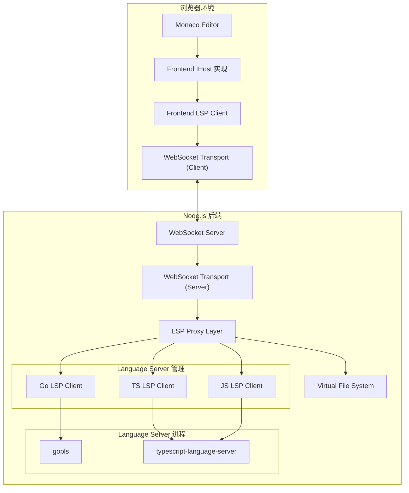

# Design Document

## Overview

本设计文档描述了一个基于 Web 的在线代码编辑器系统的架构和实现细节。该系统使用 `@lewin671/lsp-client` 库在前后端统一处理 LSP 协议通信，前端通过自定义 WebSocket Transport 与后端通信，后端通过 Stdio Transport 与各个 Language Server 进程通信。

### 核心设计理念

1. **统一的 LSP 抽象**: 前后端都使用 `@lewin671/lsp-client` 库，确保 LSP 协议处理的一致性
2. **传输层解耦**: 通过自定义 Transport 实现，将通信机制与 LSP 逻辑分离
3. **多语言支持**: 通过后端管理多个 Language Server 进程，支持 Go、JavaScript 和 TypeScript
4. **现代化技术栈**: 使用 TypeScript、Vite、Monaco Editor 等现代工具
5. **可扩展架构**: 易于添加新的编程语言支持和 LSP 功能

## Architecture

### 系统架构图



### 数据流

1. **用户编辑代码**:
   - Monaco Editor 触发编辑事件
   - Frontend IHost 捕获事件并更新 Frontend LSP Client
   - Frontend LSP Client 通过 WebSocket Transport 发送 `textDocument/didChange` 到后端
   - 后端更新 Virtual File System 并转发到对应的 Language Server

2. **代码补全请求**:
   - 用户触发补全 (Ctrl+Space)
   - Monaco Editor 调用 Frontend LSP Client 的 completion 方法
   - Frontend LSP Client 通过 WebSocket Transport 发送 `textDocument/completion` 请求
   - 后端 LSP Proxy 路由请求到对应的 Language Server LSP Client
   - Language Server 返回补全结果，经过后端转发回前端
   - Monaco Editor 显示补全列表

3. **诊断信息推送**:
   - Language Server 检测到错误
   - Backend LSP Client 接收 `textDocument/publishDiagnostics` 通知
   - 后端通过 WebSocket Transport 推送到前端
   - Frontend LSP Client 接收并通过 IHost 更新 Monaco Editor
   - Monaco Editor 显示错误标记

## Components and Interfaces

### 前端组件

#### 1. Monaco Editor 集成层

```typescript
// Monaco Editor 配置和初始化
interface EditorConfig {
  theme: 'vs-dark' | 'vs-light';
  language: string;
  automaticLayout: boolean;
  minimap: { enabled: boolean };
}

class EditorManager {
  private editor: monaco.editor.IStandaloneCodeEditor;
  private models: Map<string, monaco.editor.ITextModel>;
  
  createEditor(container: HTMLElement, config: EditorConfig): void;
  openFile(uri: string, content: string, language: string): void;
  closeFile(uri: string): void;
  getCurrentModel(): monaco.editor.ITextModel | null;
}
```

#### 2. Frontend IHost 实现

```typescript
import { IHost, IWindow, IWorkspace, IConfiguration } from '@lewin671/lsp-client';

class BrowserWindow implements IWindow {
  constructor(private editorManager: EditorManager) {}
  
  showMessage(type: MessageType, message: string): void {
    // 显示通知消息
  }
  
  logMessage(type: MessageType, message: string): void {
    // 输出到浏览器控制台
  }
  
  publishDiagnostics(uri: string, diagnostics: Diagnostic[]): void {
    // 更新 Monaco Editor 的诊断标记
    const model = this.editorManager.getModel(uri);
    if (model) {
      const markers = diagnostics.map(d => convertDiagnosticToMarker(d));
      monaco.editor.setModelMarkers(model, 'lsp', markers);
    }
  }
}

class BrowserWorkspace implements IWorkspace {
  rootUri: string = 'file:///workspace';
  
  // 可以扩展支持多文件夹
}

class BrowserConfiguration implements IConfiguration {
  get(section: string): any {
    // 从 localStorage 或配置文件读取
    return {};
  }
}

class BrowserHost implements IHost {
  window: IWindow;
  workspace: IWorkspace;
  configuration: IConfiguration;
  
  constructor(editorManager: EditorManager) {
    this.window = new BrowserWindow(editorManager);
    this.workspace = new BrowserWorkspace();
    this.configuration = new BrowserConfiguration();
  }
  
  dispose(): void {
    // 清理资源
  }
}
```

#### 3. WebSocket Transport (Client)

```typescript
import { ITransport } from '@lewin671/lsp-client';
import { MessageReader, MessageWriter } from 'vscode-jsonrpc';

class WebSocketTransport implements ITransport {
  private socket: WebSocket | null = null;
  private reader: WebSocketMessageReader | null = null;
  private writer: WebSocketMessageWriter | null = null;
  
  constructor(private url: string) {}
  
  async connect(): Promise<{ reader: MessageReader; writer: MessageWriter }> {
    return new Promise((resolve, reject) => {
      this.socket = new WebSocket(this.url);
      
      this.socket.onopen = () => {
        this.reader = new WebSocketMessageReader(this.socket!);
        this.writer = new WebSocketMessageWriter(this.socket!);
        resolve({ reader: this.reader, writer: this.writer });
      };
      
      this.socket.onerror = (error) => {
        reject(new Error('WebSocket connection failed'));
      };
    });
  }
  
  dispose(): void {
    if (this.socket) {
      this.socket.close();
      this.socket = null;
    }
  }
}

// 实现 MessageReader 和 MessageWriter 接口
class WebSocketMessageReader implements MessageReader {
  private listeners: Array<(message: any) => void> = [];
  private errorListeners: Array<(error: Error) => void> = [];
  private closeListeners: Array<() => void> = [];
  
  constructor(private socket: WebSocket) {
    this.socket.addEventListener('message', (event) => {
      try {
        const message = JSON.parse(event.data);
        this.listeners.forEach(listener => listener(message));
      } catch (error) {
        this.errorListeners.forEach(listener => 
          listener(error as Error)
        );
      }
    });
    
    this.socket.addEventListener('close', () => {
      this.closeListeners.forEach(listener => listener());
    });
    
    this.socket.addEventListener('error', (event) => {
      this.errorListeners.forEach(listener => 
        listener(new Error('WebSocket error'))
      );
    });
  }
  
  listen(callback: (message: any) => void): void {
    this.listeners.push(callback);
  }
  
  onError(callback: (error: Error) => void): void {
    this.errorListeners.push(callback);
  }
  
  onClose(callback: () => void): void {
    this.closeListeners.push(callback);
  }
  
  dispose(): void {
    this.listeners = [];
    this.errorListeners = [];
    this.closeListeners = [];
  }
}

class WebSocketMessageWriter implements MessageWriter {
  private errorListeners: Array<(error: Error) => void> = [];
  private closeListeners: Array<() => void> = [];
  
  constructor(private socket: WebSocket) {}
  
  write(message: any): Promise<void> {
    return new Promise((resolve, reject) => {
      try {
        this.socket.send(JSON.stringify(message));
        resolve();
      } catch (error) {
        reject(error);
      }
    });
  }
  
  onError(callback: (error: Error) => void): void {
    this.errorListeners.push(callback);
  }
  
  onClose(callback: () => void): void {
    this.closeListeners.push(callback);
  }
  
  dispose(): void {
    this.errorListeners = [];
    this.closeListeners = [];
  }
}
```

#### 4. Frontend LSP Client 初始化

```typescript
import { LanguageClient } from '@lewin671/lsp-client';

class FrontendLSPManager {
  private client: LanguageClient | null = null;
  
  async initialize(editorManager: EditorManager): Promise<void> {
    const host = new BrowserHost(editorManager);
    const transport = new WebSocketTransport('ws://localhost:3000/lsp');
    
    this.client = new LanguageClient(
      host,
      transport,
      {
        textDocument: {
          hover: { dynamicRegistration: true, contentFormat: ['markdown', 'plaintext'] },
          completion: { 
            dynamicRegistration: true,
            completionItem: {
              snippetSupport: true,
              documentationFormat: ['markdown', 'plaintext']
            }
          },
          definition: { dynamicRegistration: true, linkSupport: true },
          references: { dynamicRegistration: true },
          documentSymbol: { 
            dynamicRegistration: true, 
            hierarchicalDocumentSymbolSupport: true 
          },
          publishDiagnostics: { relatedInformation: true }
        }
      }
    );
    
    await this.client.start();
  }
  
  getClient(): LanguageClient {
    if (!this.client) {
      throw new Error('LSP Client not initialized');
    }
    return this.client;
  }
}
```

### 后端组件

#### 1. WebSocket Server

```typescript
import { WebSocketServer, WebSocket } from 'ws';
import { Server } from 'http';

class LSPWebSocketServer {
  private wss: WebSocketServer;
  private clients: Map<string, WebSocket> = new Map();
  
  constructor(server: Server) {
    this.wss = new WebSocketServer({ 
      server,
      path: '/lsp'
    });
    
    this.wss.on('connection', (ws: WebSocket, req) => {
      const clientId = this.generateClientId();
      this.clients.set(clientId, ws);
      
      ws.on('message', (data: Buffer) => {
        this.handleMessage(clientId, data);
      });
      
      ws.on('close', () => {
        this.handleDisconnect(clientId);
      });
    });
  }
  
  private generateClientId(): string {
    return `client-${Date.now()}-${Math.random()}`;
  }
  
  private handleMessage(clientId: string, data: Buffer): void {
    // 转发到 LSP Proxy
  }
  
  private handleDisconnect(clientId: string): void {
    this.clients.delete(clientId);
  }
}
```

#### 2. Virtual File System

```typescript
interface FileEntry {
  uri: string;
  content: string;
  version: number;
  languageId: string;
}

class VirtualFileSystem {
  private files: Map<string, FileEntry> = new Map();
  
  createFile(uri: string, content: string, languageId: string): void {
    this.files.set(uri, {
      uri,
      content,
      version: 1,
      languageId
    });
  }
  
  updateFile(uri: string, content: string): void {
    const file = this.files.get(uri);
    if (file) {
      file.content = content;
      file.version++;
    }
  }
  
  getFile(uri: string): FileEntry | undefined {
    return this.files.get(uri);
  }
  
  deleteFile(uri: string): void {
    this.files.delete(uri);
  }
  
  getAllFiles(): FileEntry[] {
    return Array.from(this.files.values());
  }
  
  // 写入到临时目录，供 Language Server 读取
  async writeToTempDir(uri: string): Promise<string> {
    const file = this.files.get(uri);
    if (!file) {
      throw new Error(`File not found: ${uri}`);
    }
    
    const tempPath = this.getTempPath(uri);
    await fs.promises.writeFile(tempPath, file.content, 'utf-8');
    return tempPath;
  }
  
  private getTempPath(uri: string): string {
    // 将 URI 转换为临时文件路径
    const parsed = new URL(uri);
    return path.join(os.tmpdir(), 'online-editor', parsed.pathname);
  }
}
```

#### 3. Language Server Manager

```typescript
import { LanguageClient, StdioTransport } from '@lewin671/lsp-client';

interface LanguageServerConfig {
  languageId: string;
  command: string;
  args: string[];
  fileExtensions: string[];
}

class LanguageServerManager {
  private clients: Map<string, LanguageClient> = new Map();
  private configs: LanguageServerConfig[] = [
    {
      languageId: 'go',
      command: 'gopls',
      args: [],
      fileExtensions: ['.go']
    },
    {
      languageId: 'typescript',
      command: 'typescript-language-server',
      args: ['--stdio'],
      fileExtensions: ['.ts', '.tsx']
    },
    {
      languageId: 'javascript',
      command: 'typescript-language-server',
      args: ['--stdio'],
      fileExtensions: ['.js', '.jsx']
    }
  ];
  
  async getOrCreateClient(
    languageId: string,
    workspaceRoot: string
  ): Promise<LanguageClient> {
    if (this.clients.has(languageId)) {
      return this.clients.get(languageId)!;
    }
    
    const config = this.configs.find(c => c.languageId === languageId);
    if (!config) {
      throw new Error(`Unsupported language: ${languageId}`);
    }
    
    const transport = new StdioTransport(config.command, config.args);
    const host = new ServerHost(workspaceRoot);
    
    const client = new LanguageClient(
      host,
      transport,
      {
        textDocument: {
          hover: { dynamicRegistration: true },
          completion: { dynamicRegistration: true },
          definition: { dynamicRegistration: true },
          references: { dynamicRegistration: true },
          documentSymbol: { dynamicRegistration: true },
          publishDiagnostics: { relatedInformation: true }
        }
      }
    );
    
    await client.start();
    this.clients.set(languageId, client);
    
    return client;
  }
  
  async stopClient(languageId: string): Promise<void> {
    const client = this.clients.get(languageId);
    if (client) {
      await client.stop();
      this.clients.delete(languageId);
    }
  }
  
  async stopAll(): Promise<void> {
    const promises = Array.from(this.clients.keys()).map(id => 
      this.stopClient(id)
    );
    await Promise.all(promises);
  }
}
```

#### 4. Backend IHost 实现

```typescript
class ServerWindow implements IWindow {
  constructor(private wsConnection: WebSocket) {}
  
  showMessage(type: MessageType, message: string): void {
    // 通过 WebSocket 发送到前端
    this.wsConnection.send(JSON.stringify({
      method: 'window/showMessage',
      params: { type, message }
    }));
  }
  
  logMessage(type: MessageType, message: string): void {
    console.log(`[${MessageType[type]}] ${message}`);
  }
  
  publishDiagnostics(uri: string, diagnostics: Diagnostic[]): void {
    // 转发到前端
    this.wsConnection.send(JSON.stringify({
      method: 'textDocument/publishDiagnostics',
      params: { uri, diagnostics }
    }));
  }
}

class ServerWorkspace implements IWorkspace {
  constructor(public rootUri: string) {}
}

class ServerConfiguration implements IConfiguration {
  get(section: string): any {
    // 从配置文件读取
    return {};
  }
}

class ServerHost implements IHost {
  window: IWindow;
  workspace: IWorkspace;
  configuration: IConfiguration;
  
  constructor(workspaceRoot: string, wsConnection?: WebSocket) {
    this.window = wsConnection 
      ? new ServerWindow(wsConnection)
      : new ConsoleWindow();
    this.workspace = new ServerWorkspace(`file://${workspaceRoot}`);
    this.configuration = new ServerConfiguration();
  }
  
  dispose(): void {}
}

class ConsoleWindow implements IWindow {
  showMessage(type: MessageType, message: string): void {
    console.log(`[Message] ${message}`);
  }
  
  logMessage(type: MessageType, message: string): void {
    console.log(`[Log] ${message}`);
  }
  
  publishDiagnostics(uri: string, diagnostics: Diagnostic[]): void {
    console.log(`[Diagnostics] ${uri}: ${diagnostics.length} issues`);
  }
}
```

#### 5. LSP Proxy Layer

```typescript
class LSPProxy {
  constructor(
    private fileSystem: VirtualFileSystem,
    private lsManager: LanguageServerManager,
    private wsConnection: WebSocket
  ) {}
  
  async handleRequest(message: any): Promise<any> {
    const { method, params, id } = message;
    
    // 路由到对应的处理器
    switch (method) {
      case 'textDocument/didOpen':
        return this.handleDidOpen(params);
      case 'textDocument/didChange':
        return this.handleDidChange(params);
      case 'textDocument/didClose':
        return this.handleDidClose(params);
      case 'textDocument/completion':
        return this.handleCompletion(params);
      case 'textDocument/hover':
        return this.handleHover(params);
      case 'textDocument/definition':
        return this.handleDefinition(params);
      case 'textDocument/references':
        return this.handleReferences(params);
      default:
        throw new Error(`Unsupported method: ${method}`);
    }
  }
  
  private async handleDidOpen(params: DidOpenTextDocumentParams): Promise<void> {
    const { textDocument } = params;
    
    // 保存到虚拟文件系统
    this.fileSystem.createFile(
      textDocument.uri,
      textDocument.text,
      textDocument.languageId
    );
    
    // 写入临时目录
    await this.fileSystem.writeToTempDir(textDocument.uri);
    
    // 获取对应的 Language Server Client
    const client = await this.lsManager.getOrCreateClient(
      textDocument.languageId,
      '/tmp/online-editor'
    );
    
    // 转发到 Language Server
    client.didOpen(params);
  }
  
  private async handleDidChange(params: DidChangeTextDocumentParams): Promise<void> {
    const { textDocument, contentChanges } = params;
    
    // 更新虚拟文件系统
    if (contentChanges.length > 0) {
      const lastChange = contentChanges[contentChanges.length - 1];
      if ('text' in lastChange) {
        this.fileSystem.updateFile(textDocument.uri, lastChange.text);
        await this.fileSystem.writeToTempDir(textDocument.uri);
      }
    }
    
    // 获取语言 ID
    const file = this.fileSystem.getFile(textDocument.uri);
    if (!file) return;
    
    const client = await this.lsManager.getOrCreateClient(
      file.languageId,
      '/tmp/online-editor'
    );
    
    client.didChange(params);
  }
  
  private async handleCompletion(params: CompletionParams): Promise<CompletionList | CompletionItem[]> {
    const file = this.fileSystem.getFile(params.textDocument.uri);
    if (!file) {
      throw new Error('File not found');
    }
    
    const client = await this.lsManager.getOrCreateClient(
      file.languageId,
      '/tmp/online-editor'
    );
    
    return client.sendRequest('textDocument/completion', params);
  }
  
  // 类似的处理器用于其他 LSP 方法...
}
```

## Data Models

### 文件模型

```typescript
interface File {
  uri: string;              // 文件 URI (file:///workspace/main.go)
  name: string;             // 文件名 (main.go)
  path: string;             // 相对路径 (/workspace/main.go)
  content: string;          // 文件内容
  languageId: string;       // 语言 ID (go, typescript, javascript)
  version: number;          // 版本号，每次修改递增
  isDirty: boolean;         // 是否有未保存的更改
}
```

### 文件树模型

```typescript
interface FileTreeNode {
  name: string;
  path: string;
  type: 'file' | 'directory';
  children?: FileTreeNode[];
}
```

### LSP 消息模型

```typescript
interface LSPRequest {
  jsonrpc: '2.0';
  id: number | string;
  method: string;
  params?: any;
}

interface LSPResponse {
  jsonrpc: '2.0';
  id: number | string;
  result?: any;
  error?: {
    code: number;
    message: string;
    data?: any;
  };
}

interface LSPNotification {
  jsonrpc: '2.0';
  method: string;
  params?: any;
}
```

## Data Models


## Correctness Properties

*A property is a characteristic or behavior that should hold true across all valid executions of a system-essentially, a formal statement about what the system should do. Properties serve as the bridge between human-readable specifications and machine-verifiable correctness guarantees.*

### File Management Properties

**Property 1: File creation persistence**
*For any* file with a supported extension (.go, .js, .ts), when created in the editor, the file should be stored in the Virtual File System and retrievable with the same content.
**Validates: Requirements 1.2**

**Property 2: Content synchronization timing**
*For any* file content change, the Backend Server should synchronize the change to the Virtual File System within 100 milliseconds.
**Validates: Requirements 1.4**

**Property 3: File switching consistency**
*For any* sequence of file switches, the Frontend Client should always display the correct content for the currently selected file as stored in the Backend Server.
**Validates: Requirements 1.5**

### Language Server Lifecycle Properties

**Property 4: Language Server lazy initialization**
*For any* supported language, when a file of that language is opened for the first time, the Backend Server should create exactly one LSP Client instance and spawn the corresponding Language Server process.
**Validates: Requirements 6.2**

**Property 5: Language Server reuse**
*For any* language, when multiple files of the same language are open, the Backend Server should reuse the same LSP Client instance and Language Server process.
**Validates: Requirements 6.4**

**Property 6: Language Server timeout termination**
*For any* Language Server process that is idle for more than 5 minutes, the Backend Server should stop the LSP Client and terminate the process.
**Validates: Requirements 6.3**

**Property 7: Language Server crash recovery**
*For any* Language Server process that crashes, the Backend Server should automatically restart the LSP Client and notify the Frontend Client.
**Validates: Requirements 6.5**

### LSP Protocol Properties

**Property 8: Edit notification propagation**
*For any* code edit in a Go, JavaScript, or TypeScript file, the Backend Server LSP Client should send a textDocument/didChange notification to the corresponding Language Server.
**Validates: Requirements 2.3, 3.3**

**Property 9: Diagnostic forwarding**
*For any* Diagnostic message received by the Backend Server LSP Client from a Language Server, the Backend Server should forward it to the Frontend Client through the WebSocket Transport.
**Validates: Requirements 2.5**

**Property 10: Diagnostic rendering**
*For any* Diagnostic message received by the Frontend Client, the Monaco Editor should display error markers and underlines at the correct positions in the code.
**Validates: Requirements 2.6**

**Property 11: Completion request routing**
*For any* completion request triggered by the user, the Frontend Client should send the request through WebSocket Transport, the Backend Server should route it to the appropriate Language Server, and the response should be forwarded back to the Frontend Client.
**Validates: Requirements 4.1, 4.2, 4.4**

**Property 12: Completion display**
*For any* Completion items received by the Frontend Client, the Monaco Editor should display them in a popup menu, and selecting an item should insert the correct code at the cursor position.
**Validates: Requirements 4.5, 4.6**

**Property 13: Definition request routing**
*For any* go-to-definition request triggered by the user, the Frontend Client should send the request through WebSocket Transport, the Backend Server should route it to the appropriate Language Server, and the response should be forwarded back to the Frontend Client.
**Validates: Requirements 5.1, 5.2, 5.4**

**Property 14: Definition navigation**
*For any* definition location received by the Frontend Client, the Monaco Editor should navigate to the target location.
**Validates: Requirements 5.5**

### WebSocket Communication Properties

**Property 15: Connection establishment timing**
*For any* connection attempt, the WebSocket Transport should establish the connection within 3 seconds or fail with an error.
**Validates: Requirements 8.1**

**Property 16: Automatic reconnection**
*For any* WebSocket Transport connection interruption, the Frontend Client should attempt to reconnect automatically with exponential backoff.
**Validates: Requirements 8.2**

**Property 17: Resynchronization after reconnection**
*For any* WebSocket Transport connection re-establishment, the Frontend Client should resynchronize all open files with the Backend Server.
**Validates: Requirements 8.3**

**Property 18: Message retry logic**
*For any* message that fails to send through the WebSocket Transport, the Online Editor System should queue the message and retry up to 3 times.
**Validates: Requirements 8.4**

### UI and User Experience Properties

**Property 19: File tree display**
*For any* file creation or opening operation, the Frontend Client should display the file in the file tree sidebar for navigation.
**Validates: Requirements 10.2**

**Property 20: Syntax highlighting**
*For any* code edit in a Go, JavaScript, or TypeScript file, the Monaco Editor should provide syntax highlighting appropriate to the language.
**Validates: Requirements 10.3**

**Property 21: Hover information display**
*For any* hover action over a symbol, the Monaco Editor should display hover information received from the Language Server.
**Validates: Requirements 10.4**

**Property 22: Loading indicators**
*For any* operation that takes longer than 200 milliseconds, the Frontend Client should display a loading indicator.
**Validates: Requirements 10.5**

### Error Handling Properties

**Property 23: Error logging format**
*For any* error encountered by the Backend Server, the Online Editor System should log the error with timestamp, severity, and stack trace.
**Validates: Requirements 11.1**

**Property 24: Language Server startup failure handling**
*For any* Language Server that fails to start, the Backend Server should log the failure reason and notify the Frontend Client with a user-friendly error message.
**Validates: Requirements 11.2**

**Property 25: Invalid response resilience**
*For any* invalid response received by the Backend Server LSP Client from a Language Server, the Backend Server should log the invalid response and continue operation without crashing.
**Validates: Requirements 11.3**

**Property 26: File system error handling**
*For any* Virtual File System operation that fails, the Backend Server should log the error and return appropriate error codes to the Frontend Client.
**Validates: Requirements 11.4**

**Property 27: WebSocket error recovery**
*For any* protocol error encountered by the WebSocket Transport, the Backend Server should log the error details and attempt to recover the connection.
**Validates: Requirements 11.5**

### Configuration Properties

**Property 28: Environment variable configuration**
*For any* deployment, the Backend Server should respect environment variable configuration for ports and Language Server paths.
**Validates: Requirements 9.5**

## Error Handling

### Frontend Error Handling

1. **WebSocket Connection Errors**
   - 连接失败时显示错误提示
   - 自动重连机制（指数退避）
   - 连接状态指示器

2. **LSP Request Errors**
   - 请求超时处理（默认 5 秒）
   - 错误响应的用户友好提示
   - 降级处理（如补全失败时不阻塞编辑）

3. **UI Errors**
   - Monaco Editor 初始化失败的回退方案
   - 文件加载失败的错误提示
   - 全局错误边界捕获未处理的异常

### Backend Error Handling

1. **Language Server Errors**
   - 启动失败时的重试机制（最多 3 次）
   - 进程崩溃时的自动重启
   - 无效响应的日志记录和忽略

2. **File System Errors**
   - 文件读写失败的错误码返回
   - 临时目录创建失败的处理
   - 磁盘空间不足的检测

3. **WebSocket Errors**
   - 客户端断开连接的清理
   - 消息解析失败的处理
   - 协议错误的恢复尝试

4. **Resource Management**
   - Language Server 进程的超时终止
   - 内存泄漏的监控和预防
   - 文件句柄的正确关闭

### Error Logging Strategy

```typescript
interface ErrorLog {
  timestamp: string;
  severity: 'error' | 'warning' | 'info';
  component: string;
  message: string;
  stack?: string;
  context?: Record<string, any>;
}

class Logger {
  log(severity: string, component: string, message: string, context?: any): void {
    const log: ErrorLog = {
      timestamp: new Date().toISOString(),
      severity: severity as any,
      component,
      message,
      stack: new Error().stack,
      context
    };
    
    // 输出到控制台
    console.log(JSON.stringify(log));
    
    // 可选：发送到日志服务
    // this.sendToLogService(log);
  }
}
```

## Testing Strategy

### Unit Testing

使用 **Vitest** 作为测试框架，为以下组件编写单元测试：

1. **Frontend Components**
   - WebSocket Transport 的连接和消息处理
   - Frontend IHost 实现的各个方法
   - EditorManager 的文件管理逻辑
   - 工具函数（URI 转换、路径处理等）

2. **Backend Components**
   - Virtual File System 的 CRUD 操作
   - Language Server Manager 的生命周期管理
   - LSP Proxy 的请求路由逻辑
   - Backend IHost 实现的各个方法

3. **Shared Utilities**
   - 消息序列化/反序列化
   - 错误处理工具
   - 配置解析

### Property-Based Testing

使用 **fast-check** 作为属性测试库，为正确性属性编写测试：

1. **配置要求**
   - 每个属性测试至少运行 100 次迭代
   - 使用 `fc.assert` 进行断言
   - 配置合适的超时时间（如 10 秒）

2. **测试标注格式**
   - 每个属性测试必须包含注释：`// Feature: online-code-editor, Property X: [property description]`
   - 例如：`// Feature: online-code-editor, Property 1: File creation persistence`

3. **测试覆盖**
   - 文件管理属性（Property 1-3）
   - Language Server 生命周期属性（Property 4-7）
   - LSP 协议属性（Property 8-14）
   - WebSocket 通信属性（Property 15-18）
   - UI 和用户体验属性（Property 19-22）
   - 错误处理属性（Property 23-27）
   - 配置属性（Property 28）

4. **生成器设计**
   - 文件内容生成器：生成有效的 Go/JS/TS 代码
   - URI 生成器：生成有效的文件 URI
   - LSP 消息生成器：生成符合协议的请求和响应
   - 编辑操作生成器：生成随机的文本编辑操作

### Integration Testing

1. **端到端测试**
   - 使用 Playwright 测试完整的用户流程
   - 测试场景：创建文件 → 编辑代码 → 获取诊断 → 代码补全 → 跳转定义

2. **LSP 集成测试**
   - 测试与真实 Language Server 的交互
   - 验证 gopls 和 typescript-language-server 的功能
   - 测试多语言文件的并发处理

3. **WebSocket 通信测试**
   - 测试连接建立和断开
   - 测试消息的双向传输
   - 测试重连机制

### Performance Testing

1. **响应时间测试**
   - 文件同步延迟（目标 < 100ms）
   - 连接建立时间（目标 < 3s）
   - 补全响应时间（目标 < 500ms）

2. **负载测试**
   - 多文件并发编辑
   - 大文件处理（> 10000 行）
   - 多客户端连接

3. **资源使用测试**
   - 内存使用监控
   - Language Server 进程数量
   - WebSocket 连接数量

## Implementation Notes

### Technology Stack

**Frontend:**
- TypeScript 5.x
- Vite 5.x（构建工具）
- Monaco Editor（代码编辑器）
- @lewin671/lsp-client（LSP 客户端）
- WebSocket API（浏览器原生）

**Backend:**
- Node.js 18+
- TypeScript 5.x
- Express（HTTP 服务器）
- ws（WebSocket 服务器）
- @lewin671/lsp-client（LSP 客户端）

**Language Servers:**
- gopls（Go）
- typescript-language-server（TypeScript/JavaScript）

**Testing:**
- Vitest（单元测试）
- fast-check（属性测试）
- Playwright（端到端测试）

### Project Structure

```
online-editor/
├── server/                 # 后端代码
│   ├── src/
│   │   ├── index.ts       # 服务器入口
│   │   ├── websocket.ts   # WebSocket 服务器
│   │   ├── lsp/
│   │   │   ├── proxy.ts   # LSP 代理层
│   │   │   ├── manager.ts # Language Server 管理器
│   │   │   └── host.ts    # Backend IHost 实现
│   │   ├── fs/
│   │   │   └── virtual.ts # 虚拟文件系统
│   │   └── transport/
│   │       └── websocket.ts # WebSocket Transport (Server)
│   ├── tests/
│   │   ├── unit/
│   │   └── property/
│   ├── package.json
│   └── tsconfig.json
├── web/                    # 前端代码
│   ├── src/
│   │   ├── main.ts        # 前端入口
│   │   ├── editor/
│   │   │   ├── manager.ts # Editor 管理器
│   │   │   └── monaco.ts  # Monaco Editor 配置
│   │   ├── lsp/
│   │   │   ├── client.ts  # Frontend LSP Client
│   │   │   └── host.ts    # Frontend IHost 实现
│   │   ├── transport/
│   │   │   └── websocket.ts # WebSocket Transport (Client)
│   │   ├── ui/
│   │   │   ├── FileTree.ts
│   │   │   └── StatusBar.ts
│   │   └── App.ts
│   ├── tests/
│   │   ├── unit/
│   │   └── property/
│   ├── index.html
│   ├── package.json
│   ├── tsconfig.json
│   └── vite.config.ts
├── package.json            # 根 package.json（workspace）
└── README.md
```

### Development Workflow

1. **开发模式**
   ```bash
   npm install          # 安装所有依赖
   npm run dev          # 启动开发服务器
   ```
   - 后端运行在 http://localhost:3000
   - 前端运行在 http://localhost:5173
   - 支持热重载

2. **生产构建**
   ```bash
   npm run build        # 构建前后端
   npm start            # 启动生产服务器
   ```
   - 后端服务静态文件和 API
   - 单一端口部署

3. **测试**
   ```bash
   npm test             # 运行所有测试
   npm run test:unit    # 运行单元测试
   npm run test:property # 运行属性测试
   npm run test:e2e     # 运行端到端测试
   ```

### Deployment Considerations

1. **环境变量**
   ```
   PORT=3000                    # 服务器端口
   WS_PORT=3000                 # WebSocket 端口（通常与 HTTP 相同）
   GOPLS_PATH=/usr/local/bin/gopls
   TS_SERVER_PATH=/usr/local/bin/typescript-language-server
   WORKSPACE_ROOT=/tmp/online-editor
   LOG_LEVEL=info
   ```

2. **Language Server 安装**
   - gopls: `go install golang.org/x/tools/gopls@latest`
   - typescript-language-server: `npm install -g typescript-language-server typescript`

3. **资源限制**
   - 限制 Language Server 进程数量
   - 设置文件大小限制（如 10MB）
   - 配置 WebSocket 连接数限制

4. **安全考虑**
   - 文件路径验证（防止路径遍历）
   - WebSocket 消息大小限制
   - 速率限制（防止 DoS）
   - CORS 配置

### Future Enhancements

1. **功能扩展**
   - 支持更多编程语言（Python、Rust、Java 等）
   - 文件持久化（保存到数据库或云存储）
   - 多用户协作编辑
   - 代码格式化和重构功能
   - 调试支持

2. **性能优化**
   - Language Server 进程池
   - 增量文件同步
   - 消息批处理
   - 缓存机制

3. **用户体验**
   - 主题切换
   - 键盘快捷键自定义
   - 代码片段
   - 搜索和替换
   - 多标签页支持

4. **运维改进**
   - 健康检查端点
   - 指标收集（Prometheus）
   - 分布式追踪
   - 日志聚合
